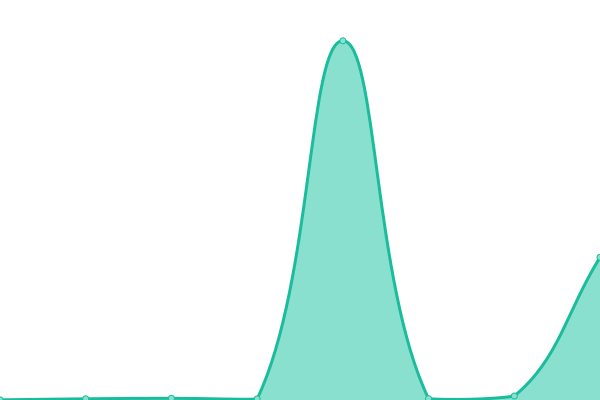
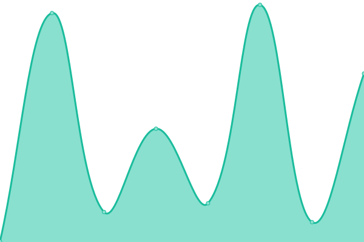

# [📈 Live Status](https://GIOSDK.github.io/growingio-sdk-upptime): <!--live status--> **🟧 Partial outage**

This repository contains the open-source uptime monitor and status page for [GIOSDK](https://GIOSDK.github.io/growingio-sdk-upptime), powered by [Upptime](https://github.com/upptime/upptime).

With [Upptime](https://upptime.js.org), you can get your own unlimited and free uptime monitor and status page, powered entirely by a GitHub repository. We use [Issues](https://github.com/GIOSDK/growingio-sdk-upptime/issues) as incident reports, [Actions](https://github.com/GIOSDK/growingio-sdk-upptime/actions) as uptime monitors, and [Pages](https://GIOSDK.github.io/growingio-sdk-upptime) for the status page.

<!--start: status pages-->
<!-- This summary is generated by Upptime (https://github.com/upptime/upptime) -->
<!-- Do not edit this manually, your changes will be overwritten -->
<!-- prettier-ignore -->
| URL | Status | History | Response Time | Uptime |
| --- | ------ | ------- | ------------- | ------ |
|  [Android SDK](https://s01.oss.sonatype.org/content/repositories/releases/com/growingio/) | 🟩 Up | [android-sdk.yml](https://github.com/GIOSDK/growingio-sdk-upptime/commits/HEAD/history/android-sdk.yml) | 

 1430ms
     
 | 

<a href="https://GIOSDK.github.io/growingio-sdk-upptime/history/android-sdk">100.00%</a>
    

|  [Web JS SDK](https://assets.giocdn.com/sdk/webjs/gdp-full.js) | 🟩 Up | [web-js-sdk.yml](https://github.com/GIOSDK/growingio-sdk-upptime/commits/HEAD/history/web-js-sdk.yml) | 

 630ms
     
 | 

<a href="https://GIOSDK.github.io/growingio-sdk-upptime/history/web-js-sdk">100.00%</a>
    

|  [Minp SDK (Wechat)](https://assets.giocdn.com/sdk/minip/4.3.0/gio-wechat.js) | 🟩 Up | [minp-sdk-wechat.yml](https://github.com/GIOSDK/growingio-sdk-upptime/commits/HEAD/history/minp-sdk-wechat.yml) | 

 275ms
     
 | 

<a href="https://GIOSDK.github.io/growingio-sdk-upptime/history/minp-sdk-wechat">100.00%</a>
    

|  [Apple SDK](https://cdn.jsdelivr.net/cocoa/Specs/6/9/7/GrowingAnalytics/4.4.0/GrowingAnalytics.podspec.json) | 🟩 Up | [apple-sdk.yml](https://github.com/GIOSDK/growingio-sdk-upptime/commits/HEAD/history/apple-sdk.yml) | 

 57ms
     
 | 

<a href="https://GIOSDK.github.io/growingio-sdk-upptime/history/apple-sdk">100.00%</a>
    

|  [Test Broken Site](https://thissitedoesnotexist.koj.co) | 🟥 Down | [test-broken-site.yml](https://github.com/GIOSDK/growingio-sdk-upptime/commits/HEAD/history/test-broken-site.yml) | 

 0ms
     
 | 

<a href="https://GIOSDK.github.io/growingio-sdk-upptime/history/test-broken-site">0.00%</a>
    

<!--end: status pages-->

[**Visit our status website →**](https://GIOSDK.github.io/growingio-sdk-upptime)

## 📄 License

- Powered by: [Upptime](https://github.com/upptime/upptime)
- Code: [MIT](./LICENSE) © [Anand Chowdhary](https://anandchowdhary.com), supported by [Pabio](https://pabio.com)
- Data in the `./history` directory: [Open Database License](https://opendatacommons.org/licenses/odbl/1-0/)
