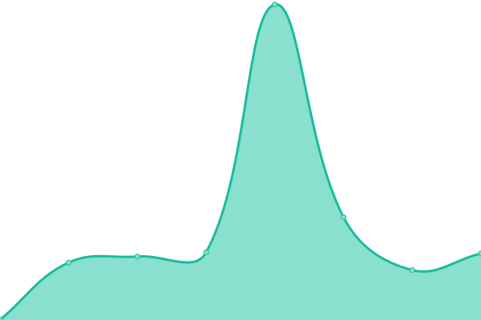

# [📈 Live Status](https://GIOSDK.github.io/growingio-sdk-upptime): <!--live status--> **🟩 All systems operational**

This repository contains the open-source uptime monitor and status page for [GIOSDK](https://GIOSDK.github.io/growingio-sdk-upptime), powered by [Upptime](https://github.com/upptime/upptime).

With [Upptime](https://upptime.js.org), you can get your own unlimited and free uptime monitor and status page, powered entirely by a GitHub repository. We use [Issues](https://github.com/GIOSDK/growingio-sdk-upptime/issues) as incident reports, [Actions](https://github.com/GIOSDK/growingio-sdk-upptime/actions) as uptime monitors, and [Pages](https://GIOSDK.github.io/growingio-sdk-upptime) for the status page.

<!--start: status pages-->
<!-- This summary is generated by Upptime (https://github.com/upptime/upptime) -->
<!-- Do not edit this manually, your changes will be overwritten -->
<!-- prettier-ignore -->
| URL | Status | History | Response Time | Uptime |
| --- | ------ | ------- | ------------- | ------ |
|  [Android SDK](https://s01.oss.sonatype.org/content/repositories/releases/com/growingio/) | 🟩 Up | [android-sdk.yml](https://github.com/GIOSDK/growingio-sdk-upptime/commits/HEAD/history/android-sdk.yml) | 

 437ms
     
 | 

<a href="https://GIOSDK.github.io/growingio-sdk-upptime/history/android-sdk">100.00%</a>
    

|  [Web JS SDK](https://assets.giocdn.com/sdk/webjs/gdp-full.js) | 🟩 Up | [web-js-sdk.yml](https://github.com/GIOSDK/growingio-sdk-upptime/commits/HEAD/history/web-js-sdk.yml) | 

 442ms
     
 | 

<a href="https://GIOSDK.github.io/growingio-sdk-upptime/history/web-js-sdk">100.00%</a>
    

|  [Minp SDK (Wechat)](https://assets.giocdn.com/sdk/minip/4.3.0/gio-wechat.js) | 🟩 Up | [minp-sdk-wechat.yml](https://github.com/GIOSDK/growingio-sdk-upptime/commits/HEAD/history/minp-sdk-wechat.yml) | 

 226ms
     
 | 

<a href="https://GIOSDK.github.io/growingio-sdk-upptime/history/minp-sdk-wechat">100.00%</a>
    

|  [Apple SDK](https://cdn.jsdelivr.net/cocoa/Specs/6/9/7/GrowingAnalytics/4.4.0/GrowingAnalytics.podspec.json) | 🟩 Up | [apple-sdk.yml](https://github.com/GIOSDK/growingio-sdk-upptime/commits/HEAD/history/apple-sdk.yml) | 

 312ms
     
 | 

<a href="https://GIOSDK.github.io/growingio-sdk-upptime/history/apple-sdk">100.00%</a>
    

|  [HarmonyOS NEXT SDK](https://repo.harmonyos.com/ohpm/@growingio/analytics/-/analytics-2.0.1.har) | 🟩 Up | [harmony-os-next-sdk.yml](https://github.com/GIOSDK/growingio-sdk-upptime/commits/HEAD/history/harmony-os-next-sdk.yml) | 

 1869ms
     
 | 

<a href="https://GIOSDK.github.io/growingio-sdk-upptime/history/harmony-os-next-sdk">100.00%</a>
    

|  [Flutter SDK](https://pub.dev/api/archives/growingio_flutter_plugin-4.2.0.tar.gz) | 🟩 Up | [flutter-sdk.yml](https://github.com/GIOSDK/growingio-sdk-upptime/commits/HEAD/history/flutter-sdk.yml) | 

 122ms
     
 | 

<a href="https://GIOSDK.github.io/growingio-sdk-upptime/history/flutter-sdk">100.00%</a>
    

|  [Go SDK](https://github.com/growingio/growingio-sdk-go/tree/v1.0.0) | 🟩 Up | [go-sdk.yml](https://github.com/GIOSDK/growingio-sdk-upptime/commits/HEAD/history/go-sdk.yml) | 

 470ms
     
 | 

<a href="https://GIOSDK.github.io/growingio-sdk-upptime/history/go-sdk">100.00%</a>
    

|  [Python SDK](https://files.pythonhosted.org/packages/44/68/db719d017a50520c3fdef7958afef5ec67c980117d6b7df713c3ad440cd4/growingio_tracker-1.0.5.tar.gz) | 🟩 Up | [python-sdk.yml](https://github.com/GIOSDK/growingio-sdk-upptime/commits/HEAD/history/python-sdk.yml) | 

 47ms
     
 | 

<a href="https://GIOSDK.github.io/growingio-sdk-upptime/history/python-sdk">100.00%</a>
    

|  [Java SDK](https://repo1.maven.org/maven2/io/growing/sdk/java/growingio-java-sdk/1.0.16-cdp/) | 🟩 Up | [java-sdk.yml](https://github.com/GIOSDK/growingio-sdk-upptime/commits/HEAD/history/java-sdk.yml) | 

 41ms
     
 | 

<a href="https://GIOSDK.github.io/growingio-sdk-upptime/history/java-sdk">100.00%</a>
    

|  [Offical Site](https://www.growingio.com) | 🟩 Up | [offical-site.yml](https://github.com/GIOSDK/growingio-sdk-upptime/commits/HEAD/history/offical-site.yml) | 

 2032ms
     
 | 

<a href="https://GIOSDK.github.io/growingio-sdk-upptime/history/offical-site">100.00%</a>
    

<!--end: status pages-->

[**Visit our status website →**](https://GIOSDK.github.io/growingio-sdk-upptime)

## 📄 License

- Powered by: [Upptime](https://github.com/upptime/upptime)
- Code: [MIT](./LICENSE) © [Anand Chowdhary](https://anandchowdhary.com), supported by [Pabio](https://pabio.com)
- Data in the `./history` directory: [Open Database License](https://opendatacommons.org/licenses/odbl/1-0/)
